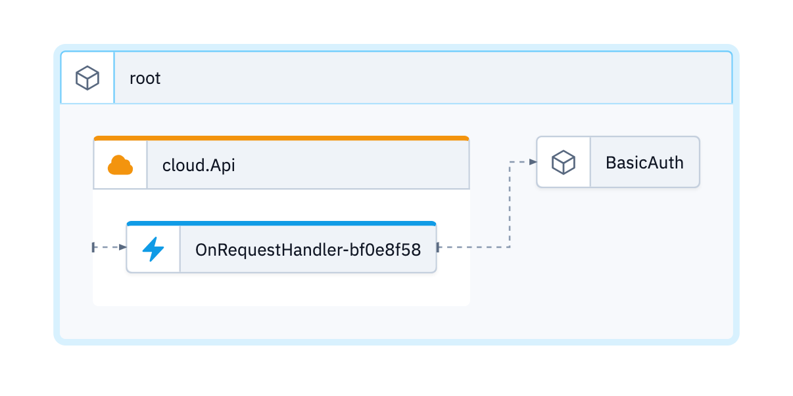

# HTTP API with Basic Auth

This is a [HTTP API](https://www.winglang.io/docs/standard-library/cloud/api)  example authenticating with Basic Auth. It's also making use of leveraging [external](https://www.winglang.io/docs/language-reference#52-javascript) Javascript - in this case for base64 en/decoding. Last but not least, it's encapsulating the Basic Authentication functionality into a dedicated [class](https://www.winglang.io/docs/examples/classes).

Since this example makes use of external Javascript, it won't run in the [Wing Playground](https://www.winglang.io/play) yet.



## Prerequisite

Please make sure to use a current and working setup of the [wing cli](https://docs.winglang.io/getting-started/installation)

## Usage

### Wing Console

```
wing it
```

### Wing Tests

```
wing test --debug  main.w
```
