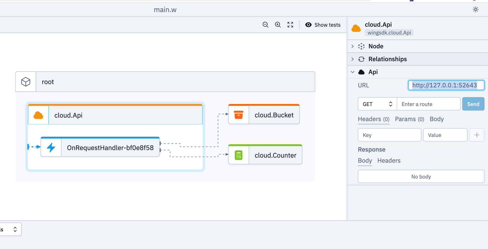
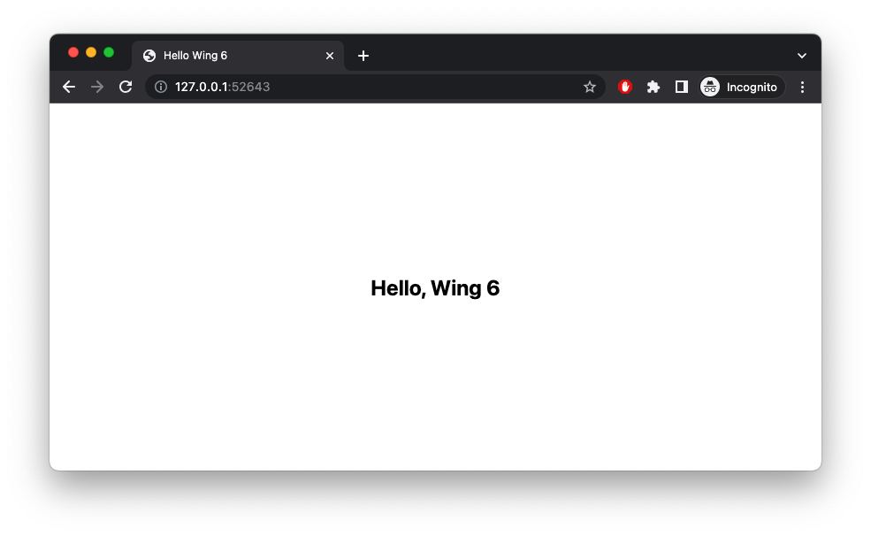

# HTTP API Server Side Rendered HTML

This is a [HTTP API](https://www.winglang.io/docs/standard-library/cloud/api) example rendering a HTML template from a [Bucket](https://www.winglang.io/docs/standard-library/cloud/bucket). It's making use of [external](https://www.winglang.io/docs/language-reference#52-javascript) Javascript - in this case reading the template (preflight) and rendering it (inflight).

Since this example makes use of external Javascript, it won't run in the [Wing Playground](https://www.winglang.io/play) yet.


## Prerequisite

Please make sure to use a current and working setup of the [wing cli](https://docs.winglang.io/getting-started/installation)

## Usage

### Wing Console

```
wing it
```

Get the URL from the API and open it in the browser. Each page reload will increase the counter.




### Wing Tests

```
wing test --debug  main.w
```
