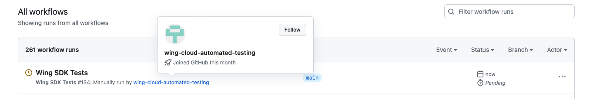

# Feedreader

This is an example of a WingLang project that demonstrates the usage of cloud services to read a Github Atom feed and trigger a Github Action when a new version is detected.

## Usage

1. Set up a new cloud secret with the name "github-token" and your Github token as the value.
2. Deploy the project.
3. The program will run every hour, checking the Github Atom feed for new versions.
4. If a new version is detected, it will trigger the specified Github Action and store a record in a cloud bucket.
5. Add `workflow_dispatch:` to the Github Action you want to trigger. This allows the action to be run manually from the Github Actions UI or API.

