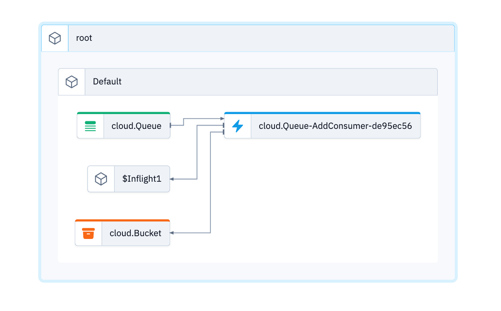

# Hello Wing

The example from the [getting started](https://docs.winglang.io/getting-started/hello) guide.

This is a simple example of a WingLang project that demonstrates the usage of cloud services. The program creates a cloud bucket and a cloud queue. It then adds a consumer to the queue, which writes a message to a file in the bucket.

You can also open this in the [Wing Playground](https://play.winglang.io/?code=YnJpbmcgY2xvdWQ7DQoNCmxldCBidWNrZXQgPSBuZXcgY2xvdWQuQnVja2V0KCk7DQpsZXQgcXVldWUgPSBuZXcgY2xvdWQuUXVldWUoKTsNCg0KcXVldWUuYWRkQ29uc3VtZXIoaW5mbGlnaHQgKG1lc3NhZ2U6IHN0cikgPT4gew0KICBidWNrZXQucHV0KCJ3aW5nLnR4dCIsICJIZWxsbywgJHttZXNzYWdlfSIpOw0KfSk7)



## Prerequisite

Please make sure to use a current and working setup of the [wing cli](https://docs.winglang.io/getting-started/installation)

## Usage

### Wing Console

```
wing it
```

### Wing Tests

```
wing test --debug  main.w
```
