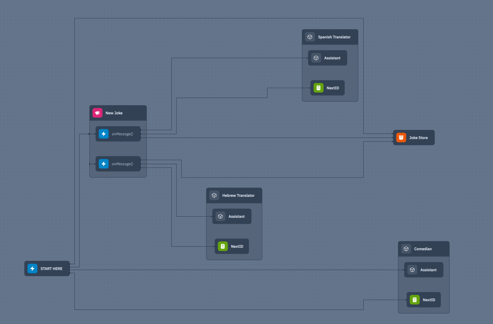

# HTTP API Server Side Rendered HTML

This is an example of how to use openai API with Wing.

It is an app that uses the openai API to generate jokes and then to translate them to different languages.
Both the original joke in English and all the translations are put in a `cloud.Bucket`.

The joke generator (Comedian class), and the translators (Translator class) use an Assistant class that is a wrapper around the openai API. The example uses the JS API for openai and calls it from Wing with the `extern` command.

Once a joke is generater it is sent to a `cloud.Topic` that the translators subscribe to.

The translators then translate the joke to different languages and put the translations in the `cloud.Bucket`.

Since this example makes use of external Javascript, it won't run in the [Wing Playground](https://www.winglang.io/play) yet.



## Prerequisite

Please make sure to use a current and working setup of the [wing cli](https://docs.winglang.io/getting-started/installation)

## Usage

### Wing Console

Uncomment line 7 or 8 in `openai.js` to use the `openai` API key.

```sh
npm install
wing it
```

Invoke the "START HERE" function, see the results in the "Joke Store".