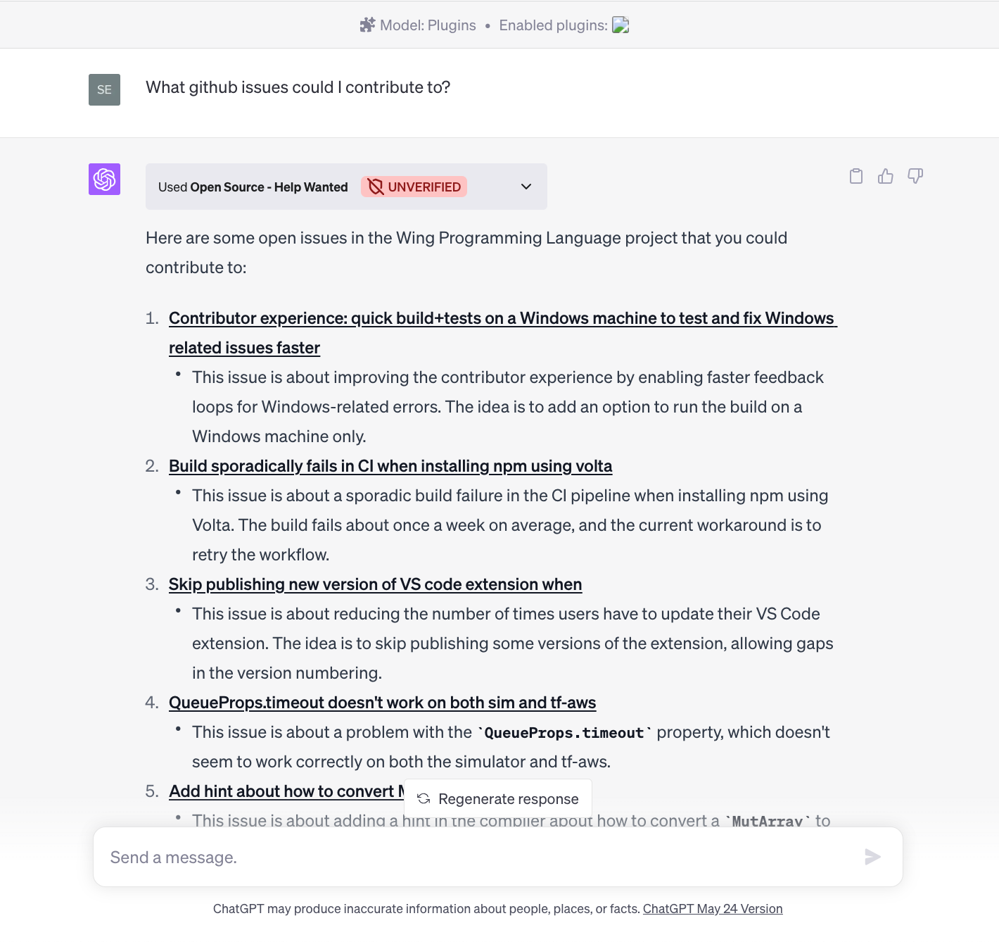
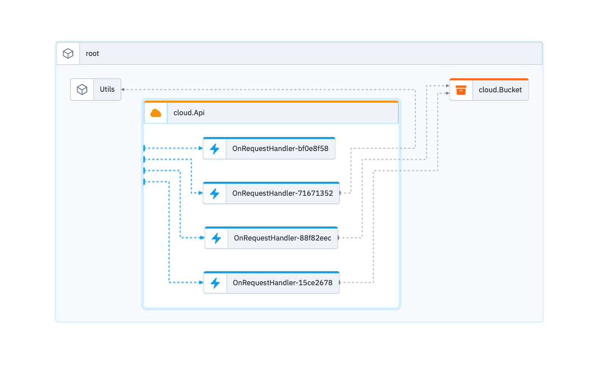

# OpenAI Plugin - Github Help Wanted

Finding issues explicitly tagged as open for contributions in open source repositories. It's currently limited to the [winglang/wing](https://github.com/winglang/wing) repository

While this plugin right now is fetching the data live, it could potentially be extended in a way to index a few repos (and update via some sort of issue feed), which would open up the opportunity to use more resources from the SDK.

## Usage

You'll have to have a premium subscription of OpenAI to use plugins in ChatGPT. Read more about plug in development [here](https://platform.openai.com/docs/plugins/getting-started)

As described in these docs, it's possible to use it from localhost. So really all you have to do is run the following:

### Setup

Initially, make sure to copy & update the hostnames to match your setup in this file [./.well-known/ai-plugin.example.json](./.well-known/ai-plugin.example.json). It's possible to use `localhost` as well (see linked OpenAI docs).

```
cp ./.well-known/ai-plugin.example.json ./.well-known/ai-plugin.json
// edit the fields
npm install
```

### Wing it

```
wing it
```

And follow [these](https://platform.openai.com/docs/plugins/getting-started/running-a-plugin) instructions to test the plugin.

## Plugin Screenshot



## Architecture


