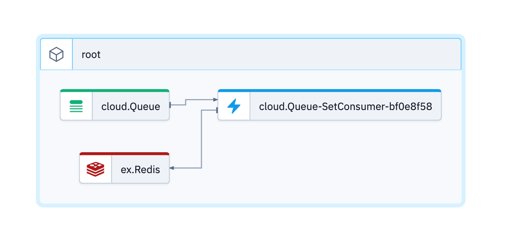

# Redis example

The example is using Redis from the [external SDK](https://www.winglang.io/docs/standard-library/ex/api-reference#redis-)

You can also open this in the [Wing Playground](https://www.winglang.io/play/?code=YgByAGkAbgBnACAAYwBsAG8AdQBkADsACgBiAHIAaQBuAGcAIABlAHgAOwAKAGIAcgBpAG4AZwAgAHUAdABpAGwAOwAKAAoAbABlAHQAIABxAHUAZQB1AGUAIAA9ACAAbgBlAHcAIABjAGwAbwB1AGQALgBRAHUAZQB1AGUAKAApADsACgBsAGUAdAAgAHIAZQBkAGkAcwAgAD0AIABuAGUAdwAgAGUAeAAuAFIAZQBkAGkAcwAoACkAOwAKAAoAcQB1AGUAdQBlAC4AcwBlAHQAQwBvAG4AcwB1AG0AZQByACgAaQBuAGYAbABpAGcAaAB0ACAAKABtAGUAcwBzAGEAZwBlADoAIABzAHQAcgApACAAPQA%2BACAAewAKACAAIAByAGUAZABpAHMALgBzAGUAdAAoACIAaABlAGwAbABvACIALAAgAG0AZQBzAHMAYQBnAGUAKQA7AAoAfQAsACAAdABpAG0AZQBvAHUAdAA6ACAAMwBzACkAOwAKAAoAdABlAHMAdAAgACIASABlAGwAbABvACwAIAB3AG8AcgBsAGQAIQAiACAAewAKACAAIABxAHUAZQB1AGUALgBwAHUAcwBoACgAIgB3AG8AcgBsAGQAIQAiACkAOwAKAAoAIAAgAHUAdABpAGwALgB3AGEAaQB0AFUAbgB0AGkAbAAoACgAKQA6ACAAYgBvAG8AbAAgAD0APgAgAHsACgAgACAAIAAgAGwAbwBnACgAIgBDAGgAZQBjAGsAaQBuAGcAIABpAGYAIAByAGUAZABpAHMAIABrAGUAeQAgAGUAeABpAHMAdABzACIAKQA7AAoAIAAgACAAIAByAGUAdAB1AHIAbgAgAHIAZQBkAGkAcwAuAGcAZQB0ACgAIgBoAGUAbABsAG8AIgApACAAIQA9ACAAbgBpAGwAOwAKACAAIAB9ACkAOwAKAAoAIAAgAGEAcwBzAGUAcgB0ACgAIgB3AG8AcgBsAGQAIQAiACAAPQA9ACAAIgAkAHsAcgBlAGQAaQBzAC4AZwBlAHQAKAAiAGgAZQBsAGwAbwAiACkAfQAiACkAOwAKAH0A) (as of mid of Jul 2023 the Redis resource is not supported in the Playground due to its Docker dependency)



## Prerequisite

Please make sure to use a current and working setup of the [wing cli](https://docs.winglang.io/getting-started/installation)

## Usage

### Wing Console

```
wing it
```

### Wing Tests

```
wing test --debug  main.w
```
