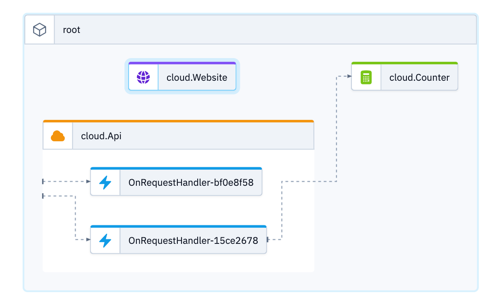
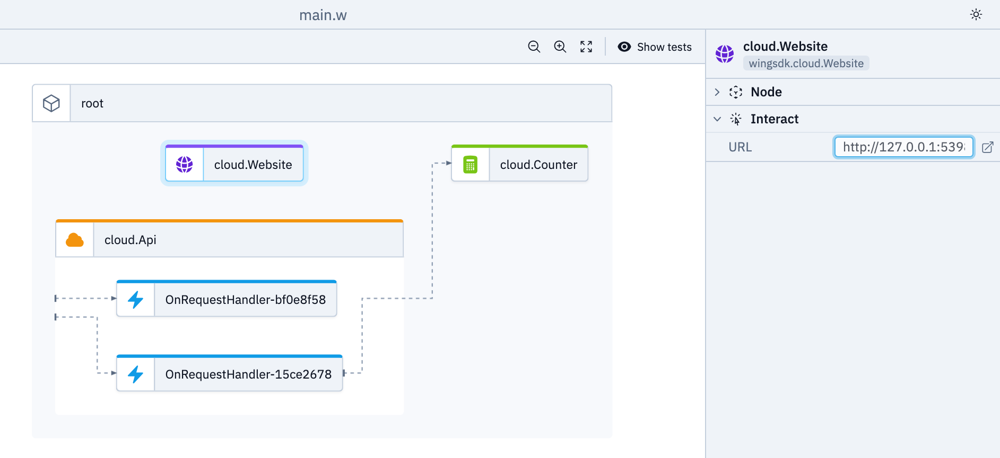
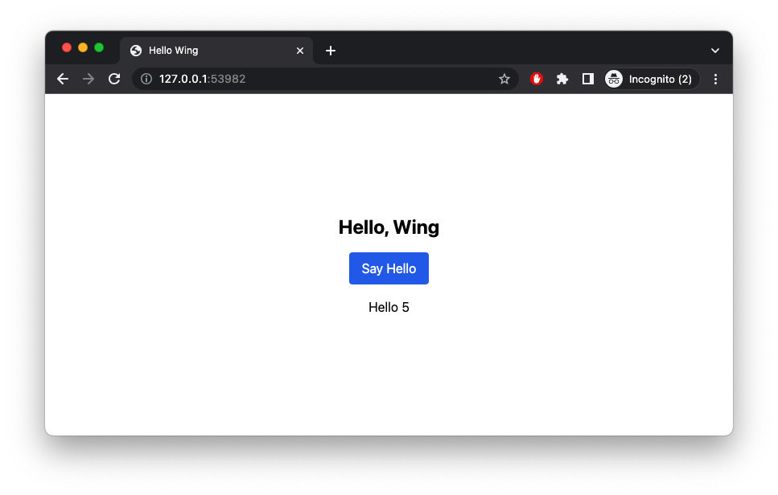

# Static Website

This is a [Static Website](https://www.winglang.io/docs/standard-library/cloud/website) example in combination with an [API](https://www.winglang.io/docs/standard-library/cloud/api). The [./static](./static/index.html) page is using [htmx](https://htmx.org/) to dynamically fetch an HTML snippet with value dervied from a [Counter](https://www.winglang.io/docs/standard-library/cloud/counter). Since Website and API are served via different domains, the API is CORS enabled.



## Prerequisite

Please make sure to use a current and working setup of the [wing cli](https://docs.winglang.io/getting-started/installation)

## Usage

### Wing Console

```
wing it
```

Get the URL from the Website and open it in the browser.




### Wing Tests

```
wing test --debug  main.w
```
