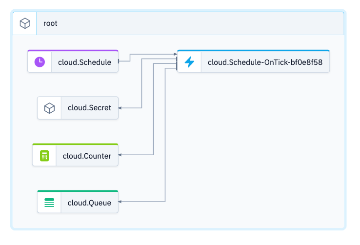
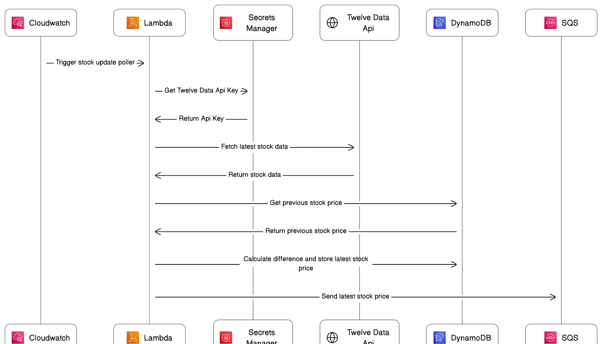

# Simple Stock Poller

This is an example for a simple stock polling application, that retrieves data from [Twelve Data API](https://twelvedata.com/), stores the latest stock price in DynamoDB and publishes the update to a SQS queue.



It show case the capabilities of Wing to fetch data from an external API and distribute this across different systems.



## Prerequisite

Please make sure to use a current and working setup of the [wing cli](https://docs.winglang.io/getting-started/installation)

## Usage

As the Scheduler component is only available with the `sim` and `tf-aws` provider, you do have to compile and then deploy the application.
For more details see also [Wing compatability matrix](https://www.winglang.io/docs/standard-library/compatibility-matrix).

### Wing Console

```
wing it
```

To test the application in the Wing Console, you have to set up a secret at `~/.wing/secrets.json`. For more details refer to [Secrets with the Simulator target](https://www.winglang.io/docs/standard-library/cloud/secret#simulator-sim).

### Wing compile

```
wing compile --target tf-aws stock-poller.w

cd target/stock-updates.tfaws
```

### Initialization
For your first deployment you have to initialize Terraform in the working directory:
```
terraform init
```

And you also need to create the secret in [AWS Secrets Manager](https://docs.aws.amazon.com/secretsmanager/latest/userguide/intro.html), refer also to [documentation of `cloud.secret` for AWS as target](https://www.winglang.io/docs/standard-library/cloud/secret#aws-tf-aws-and-awscdk).
```
aws secretsmanager create-secret --name twelve-data-api-key --secret-string your_api_key
```

### Wing deploy
```
terraform apply
```
